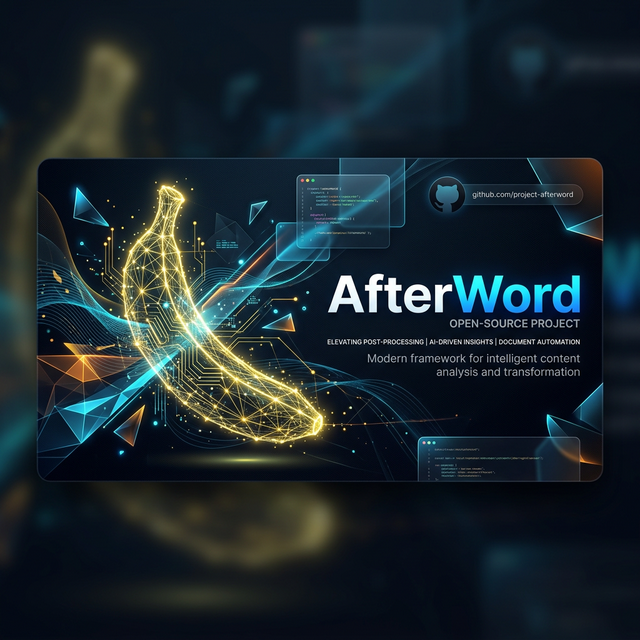

<div align="center">



</div>

<div align="center">


</div>

<br/>

<div align="center">

[](https://nextjs.org)
[](https://typescriptlang.org)
[](https://convex.dev)
[](https://tailwindcss.com)
[](https://huggingface.co/Equall/Saul-Instruct-v1)
[](LICENSE)

</div>

<div align="center">


</div>

---

<br/>

## ✦ &nbsp; The Problem

<table>
<tr>
<td width="50%">

When a person dies, their family inherits a digital life they never asked to manage.

**100 online accounts.** Banks, streaming services, social media, government portals, insurance, healthcare, e-commerce — all sitting open, many still billing.

**15 months** is the average time a family spends trying to close them.  
**$2,160/year** in subscriptions continue charging the estate.  
**0 tools** existed to help — until now.

</td>
<td width="50%">

```
3,600,000  US deaths per year
      100  avg accounts per person
   15 mo.  avg digital estate closeout
   $2,160  avg annual ghost charges
        0  open-source tools (before this)
```

> *"94.5% of families report the digital estate process caused physical and mental health deterioration on top of their grief."*
> — Empathy Cost of Dying Report, 2024

</td>
</tr>
</table>

<br/>

---

## ✦ &nbsp; The Solution

<div align="center">

```
╔═══════════════════════════════════════════════════════════════════════╗
║                                                                       ║
║        🧓  OWNER                              👤  FAMILY              ║
║        Plans ahead                            Closes accounts         ║
║                                                                       ║
║   Add accounts + notes          Unlock trigger: name + date + state   ║
║   Choose invitees + roles     → Trusted guardian receives OTP code    ║
║   Name a trusted guardian     → Estate unlocks + invites fire         ║
║   Update vault anytime        → AI letters + playbooks + tracking     ║
║                                 ↓                                     ║
║                          Evidence bundle for probate                  ║
║                                                                       ║
╚═══════════════════════════════════════════════════════════════════════╝
```

</div>

Afterword is a **two-sided platform**. A living person can set up their estate in 20 minutes — adding accounts, writing executor notes, and designating a trusted guardian who controls the unlock key. When they pass, their family unlocks the estate through a **two-factor verification system**, then follows AI-generated playbooks to close every account.

**No prior setup required.** If the deceased never used Afterword, the family can still use every feature — manual account entry, AI letter generation, real-time Kanban tracking, and the evidence bundle — without any pre-registration.

<br/>

---

## 🔑 &nbsp; The Trusted Guardian Unlock

The most security-critical feature. Two factors are required to unlock an estate — neither alone is sufficient.

<div align="center">

| Step | Factor | What It Is | What It Prevents |
|:----:|--------|-----------|-----------------|
| **1** | **Knowledge** | Deceased's full legal name + date of passing + state | Requires genuine knowledge of the deceased |
| **2** | **Possession** | 6-digit OTP emailed to the trusted guardian | Blocks anyone who read an obituary |

</div>

```
Anyone →  /unlock  →  Enter name + date + state
                              ↓
                    [Match found in estate DB]
                              ↓
                    OTP → Guardian's email inbox
                              ↓
              Guardian verifies request is legitimate
                              ↓
                    Guardian shares 6-digit code
                              ↓
                    Estate unlocks. Invitations fire.
```

> **Why not just the death date?** Obituaries are public. Anyone can know a name, death date, and state. The trusted guardian is the human firewall that no algorithm can replace.

<br/>

---

## 🤖 &nbsp; AI Legal Letters — Powered by Saul-Instruct-v1

<table>
<tr>
<td>

**Model:** `Equall/Saul-Instruct-v1`  
**Training:** 30 billion tokens of legal text  
**License:** MIT  
**Cost:** Free via HuggingFace Serverless Inference  

</td>
<td>

Afterword generates a **unique legal closure letter** for every account, tailored by urgency tier:

- 🔴 **CHARGING** — Immediate cancellation + refund demand
- 🟠 **IDENTITY** — Closure + data deletion + CCPA/GDPR reference
- 💙 **SENTIMENTAL** — Data export request before closure
- ⚪ **ADMIN** — Standard administrative closure

</td>
</tr>
</table>

Letters are **RUFADAA-aware** — the Revised Uniform Fiduciary Access to Digital Assets Act is referenced automatically for the 46 states that have adopted it. Every letter is editable inline before sending.

<br/>

---

## 🏗️ &nbsp; Architecture

```
afterword/
├── apps/
│   └── web/
│       ├── app/                        # Next.js 15 App Router
│       │   ├── page.tsx               # Landing — dual-path hero
│       │   ├── unlock/                # Estate unlock trigger
│       │   ├── verify/[token]/        # Invitee verification gate
│       │   ├── dashboard/             # Owner vault
│       │   │   ├── new/               # Account creation
│       │   │   └── preview/           # Dry-run mode
│       │   ├── setup/                 # Owner setup flow
│       │   │   ├── about-you/
│       │   │   ├── accounts/
│       │   │   ├── invitees/
│       │   │   └── guardian/          # Trusted guardian config
│       │   ├── estate/[id]/           # Executor estate board
│       │   │   ├── account/[id]/      # Account detail + playbook
│       │   │   │   └── letter/        # AI letter preview + edit
│       │   │   └── export/            # Evidence bundle download
│       │   └── api/auth/callback/     # Gmail OAuth callback (only API route)
│       ├── components/
│       │   ├── estate/                # Board, cards, kanban
│       │   ├── letter/                # Letter preview, editor
│       │   ├── onboarding/            # Owner setup steps
│       │   └── ui/                    # Design system components
│       └── lib/
│           ├── crypto.ts              # AES-256-GCM client encryption
│           └── session.ts             # Session token management
│
├── convex/                            # ALL backend logic lives here
│   ├── schema.ts                      # Single source of truth — 10 tables
│   ├── accounts.ts                    # Account queries + mutations
│   ├── estates.ts                     # Estate lifecycle
│   ├── owners.ts                      # Owner vault management
│   ├── unlock.ts                      # Unlock trigger + OTP system
│   ├── invites.ts                     # Invitation token system
│   ├── crons.ts                       # 90-day auto-delete scheduler
│   ├── ai/
│   │   ├── generateLetter.ts          # Saul-Instruct letter generation
│   │   └── classifyService.ts         # Account tier classification
│   └── export/
│       └── evidenceBundle.ts          # pdf-lib evidence bundle
│
└── packages/
    └── platforms-db/                  # Community-maintained platform data
        └── data/
            ├── streaming.ts           # Netflix, Spotify, Disney+...
            ├── financial.ts           # Chase, PayPal, Robinhood...
            ├── social.ts              # Facebook, LinkedIn, TikTok...
            ├── health.ts              # Insurance, pharmacy, fitness...
            └── government.ts          # SSA, IRS, Medicare, USPS...
```

<br/>

---

## ⚡ &nbsp; Tech Stack

<div align="center">

| Layer | Technology | Version | Why |
|-------|-----------|---------|-----|
| **Frontend** | Next.js | 16.1.6 | App Router, React 19, Turbopack |
| **Language** | TypeScript | 5.x | End-to-end type safety with Convex |
| **Styling** | Tailwind CSS | 4.x | CSS-first, design tokens in globals.css |
| **Database + Backend** | Convex | 1.32.0 | Replaces Express + Prisma + Postgres entirely |
| **AI** | Saul-Instruct-v1 | 2024-03 | Legal-domain LLM, MIT license, free tier |
| **Email** | Resend | latest | Invitation + OTP + alert emails |
| **PDF** | pdf-lib | 1.17.1 | Evidence bundle + individual letter PDFs |
| **Monorepo** | Turborepo | 2.x | Shared types across Next.js + Convex |
| **Deployment** | Vercel + Convex Cloud | — | Both free tier, git-push deploy |

</div>

**Total monthly infrastructure cost: `$0`**  
Convex Starter (50GB free) + HuggingFace Serverless (free) + Vercel Hobby (free) + Resend (free tier) = zero spend.

<br/>

---

## 🔐 &nbsp; Privacy Architecture

> **This is not a policy promise. It is a technical guarantee.**

<table>
<tr>
<td width="55%">

**AES-256-GCM encryption — in the browser**  
Every piece of PII (names, emails, account notes, guardian contact) is encrypted *before* it leaves your browser. Convex stores only ciphertext. A full database breach reveals nothing readable.

**No email body access — ever**  
The Gmail integration uses `gmail.metadata` scope only — the most restricted scope available. It physically cannot access email bodies, attachments, drafts, or sent mail. This is enforced by the OAuth scope, not by policy.

**Token revoked immediately post-scan**  
The Gmail OAuth token is stored encrypted for a maximum of 2 hours and is programmatically revoked via Google's token revocation endpoint the moment scanning completes.

**90-day auto-delete**  
Every estate auto-erases 90 days after final closure. Implemented as a Convex scheduled cron function — not a checkbox in a settings menu.

</td>
<td width="45%">

```
Client Browser
┌─────────────────────────┐
│  AES-256-GCM encrypt    │
│  all PII fields         │
│  before any fetch()     │
└────────────┬────────────┘
             │ ciphertext only
             ▼
Convex Database
┌─────────────────────────┐
│  Stores encrypted blobs │
│  Session token SHA-256  │
│  hash only — no raw     │
│  tokens ever stored     │
└─────────────────────────┘

Gmail API
┌─────────────────────────┐
│  scope: gmail.metadata  │
│  reads: sender, subject │
│  CANNOT: read bodies    │
│  Token: revoked in 2hr  │
└─────────────────────────┘
```

</td>
</tr>
</table>

<br/>

---

## 🖥️ &nbsp; Screens Overview

**22 screens** across three user paths.

<details>
<summary><strong>Path A — Owner (8 screens)</strong> — The living person planning ahead</summary>

| Screen | Route | Description |
|--------|-------|-------------|
| Landing Page | `/` | Dual-path hero. Two equal CTAs. Stats bar. Guardian explainer. |
| Create Account | `/dashboard/new` | 4-word passphrase setup. Recovery warning. |
| Personal Details | `/setup/about-you` | Full legal name. Verification key preview. |
| Add Accounts | `/setup/accounts` | Manual entry with notes. 200+ platform autocomplete. |
| Choose Invitees | `/setup/invitees` | 4 role types. Personal message. |
| Name Guardian | `/setup/guardian` | Trusted guardian email. OTP email preview. |
| Vault Dashboard | `/dashboard` | Completeness score. Account list. Invitee panel. |
| Dry Run Preview | `/dashboard/preview` | Owner previews the full invitee experience. |

</details>

<details>
<summary><strong>Path B — Unlock Event (4 screens)</strong> — The moment everything activates</summary>

| Screen | Route | Description |
|--------|-------|-------------|
| Unlock Entry | `/unlock` | Name + date + state form. Accessible to anyone. |
| OTP Waiting | `/unlock` (state) | 6-box OTP input. 10-minute countdown. Guardian note. |
| No Match | `/unlock` (state) | Non-revealing message. Offers standalone executor path. |
| Unlock Confirmed | `/unlock` (state) | Checkmark animation. Invitations firing confirmation. |

</details>

<details>
<summary><strong>Path C — Executor / Invitee (8 screens)</strong> — Closing every account</summary>

| Screen | Route | Description |
|--------|-------|-------------|
| Verification Gate | `/verify/[token]` | 3-field identity check. 5 attempts. Warm tone. |
| Estate Board | `/estate/[id]` | 4-column Kanban. Urgency tiers. Real-time sync. |
| Account Detail | `/estate/[id]/account/[id]` | Owner notes first. Playbook steps. Confirmation field. |
| Letter Preview | `/estate/[id]/account/[id]/letter` | AI letter. Inline editing. PDF download. |
| Evidence Bundle | `/estate/[id]/export` | Bundle download. Confetti on first download. |

</details>

<details>
<summary><strong>System Screens (2)</strong></summary>

| Screen | Route | Description |
|--------|-------|-------------|
| Demo Mode | `/?demo=true` | Pre-seeded "Estate of Maria Santos". Amber banner. |
| Account Locked | `/unlock` or `/verify` | Rate limit lockout. Countdown. Support link. |

</details>

<br/>

---

## 🚀 &nbsp; Getting Started

### Prerequisites

```bash
node >= 20.0.0
npm >= 10.0.0
```

### 1. Clone and install

```bash
git clone https://github.com/your-team/afterword.git
cd afterword
npm install
```

### 2. Configure environment

```bash
# apps/web/.env.local
NEXT_PUBLIC_CONVEX_URL=https://your-project.convex.cloud
GOOGLE_CLIENT_ID=your_google_client_id
GOOGLE_CLIENT_SECRET=your_google_client_secret
NEXT_PUBLIC_APP_URL=http://localhost:3000
```

```bash
# Set Convex environment variables (in Convex dashboard or CLI)
npx convex env set HF_TOKEN hf_your_token
npx convex env set RESEND_API_KEY re_your_key
npx convex env set ENCRYPTION_SECRET your_32_byte_secret
```

### 3. Start development

```bash
# Starts Next.js (Turbopack) + Convex dev server simultaneously
npm run dev
```

### 4. Seed the platforms database

```bash
npx convex run scripts/seedPlatforms
```

### 5. Load demo estate

```bash
npx convex run scripts/resetDemo
# Then visit: http://localhost:3000?demo=true
```

<br/>

---

## 🌍 &nbsp; Contributing

The **platforms database** (`packages/platforms-db/`) is the highest-value community asset in this project. Platform closure processes change. New services launch. Old ones close.

Every PR that adds or updates a platform playbook is meaningful.

```typescript
// packages/platforms-db/data/streaming.ts — example entry
{
  name:         "Netflix",
  domain:       "netflix.com",
  category:     "STREAMING",
  closureUrl:   "https://www.netflix.com/cancelplan",
  docsRequired: ["Death Certificate"],
  playbook: [
    { step: 1, text: "Sign in to the account at netflix.com" },
    { step: 2, text: "Go to Account → Membership & Billing → Cancel Membership" },
    { step: 3, text: "If access is unavailable, call 1-866-579-7172 and reference bereavement policy" },
    { step: 4, text: "Request written confirmation and refund of any charges after date of death" },
  ],
  avgCloseDays: 3,
  lastVerified: "2026-01",
}
```

### How to add a platform

1. Fork the repository
2. Add your platform entry to the appropriate file in `packages/platforms-db/data/`
3. Verify the closure URL is current and the playbook steps are tested
4. Submit a pull request with the platform name in the title

See [`CONTRIBUTING.md`](CONTRIBUTING.md) for the full guide.

<br/>

---

## ⚖️ &nbsp; Legal Context

Afterword generates letters that reference **RUFADAA** — the Revised Uniform Fiduciary Access to Digital Assets Act, adopted in 46 US states. This law grants executors and personal representatives the legal right to access and manage a deceased person's digital assets.

Afterword is **not a substitute for legal advice**. The evidence bundle it produces may be submitted to probate court but should be reviewed by an estate attorney.

<br/>

---

## 🗺️ &nbsp; Roadmap

```
v1.0  ✅  Owner vault + Trusted guardian unlock + AI letters + Evidence bundle
v1.1  🔲  Outlook / Microsoft inbox scan
v1.2  🔲  Spanish + French letter generation
v1.3  🔲  International platforms — UK, Canada, Australia
v2.0  🔲  Direct closure APIs for top 10 platforms
v2.1  🔲  Upgrade to SaulLM-54B when available on HF free tier
v2.2  🔲  Crypto wallet notification workflows
v3.0  🔲  EU GDPR letter templates + international jurisdiction support
```

<br/>

---

<div align="center">


**Afterword** &nbsp;·&nbsp; MIT License &nbsp;·&nbsp; sudo make world 2026

*Built with 🕯️ for the people left behind.*

</div>